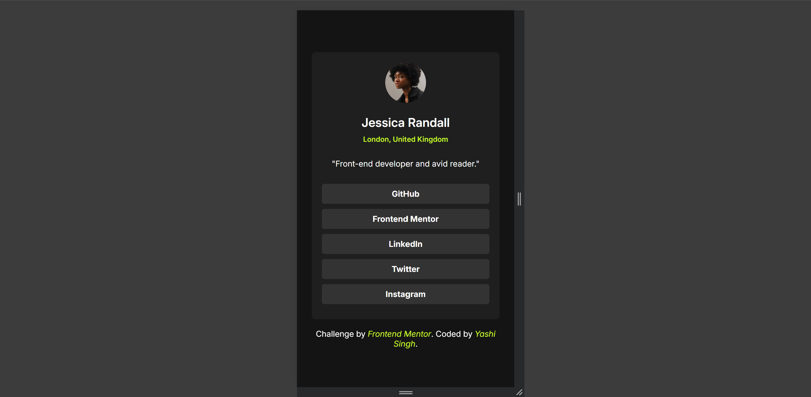

# Frontend Mentor - Social Links Profile Solution

This is a solution to the [Social Links Profile challenge on Frontend Mentor](https://www.frontendmentor.io/challenges/social-links-profile-UG32l9m6dQ). Frontend Mentor challenges help you improve your coding skills by building realistic projects.

## Table of Contents

- [Overview](#overview)
  - [The Challenge](#the-challenge)
  - [Screenshot](#screenshot)
  - [Links](#links)
- [My Process](#my-process)
  - [Built With](#built-with)
  - [What I Learned](#what-i-learned)
  - [Continued Development](#continued-development)
  - [Useful Resources](#useful-resources)
- [Author](#author)
- [Acknowledgments](#acknowledgments)

## Overview

### The Challenge

Users should be able to:
- See hover and focus states for all interactive elements on the page.

### Screenshot

### Links

- Live Site URL: [Live Site](https://social-link-profile-by-yashi.netlify.app/)

## My Process

### Built With

- Semantic HTML5 markup
- CSS custom properties
- Flexbox
- Mobile-first workflow
- [Google Fonts](https://fonts.google.com/) - For font styling

### What I Learned

In this project, I learned to:
- Implement hover and focus states effectively for interactive elements.
- Use CSS custom properties to maintain a consistent color scheme.
- Adjust layouts responsively with media queries to ensure compatibility across various device sizes.

<pre><code>

    <section class="profile-info">
        <h2>Jessica Randall</h2>
        
London, United Kingdom

        
"Front-end developer and avid reader."

    </section>

</code></pre>

<pre></code>

    .social-links a:hover {
        background-color: var(--green);
        color: var(--grey-700);
    }

</code></pre>

### Continued Development

I plan to continue improving:
- My responsiveness techniques to handle more diverse screen sizes.
- The performance optimization of my CSS for better load times.
- My understanding of accessibility features in web design.

### Useful Resources

- [MDN Web Docs](https://developer.mozilla.org/en-US/) - Great for learning about HTML and CSS properties.
- [CSS-Tricks](https://css-tricks.com/) - Helpful articles and examples on CSS techniques.

## Author

- Frontend Mentor - [@Yashi-Singh-1](https://www.frontendmentor.io/profile/Yashi-Singh-1)
- LinkedIn - [Yashi Singh](www.linkedin.com/in/yashi-singh-b4143a246)

## Acknowledgments

A big thank you to the Frontend Mentor community for providing such engaging challenges and to my peers for their constructive feedback.